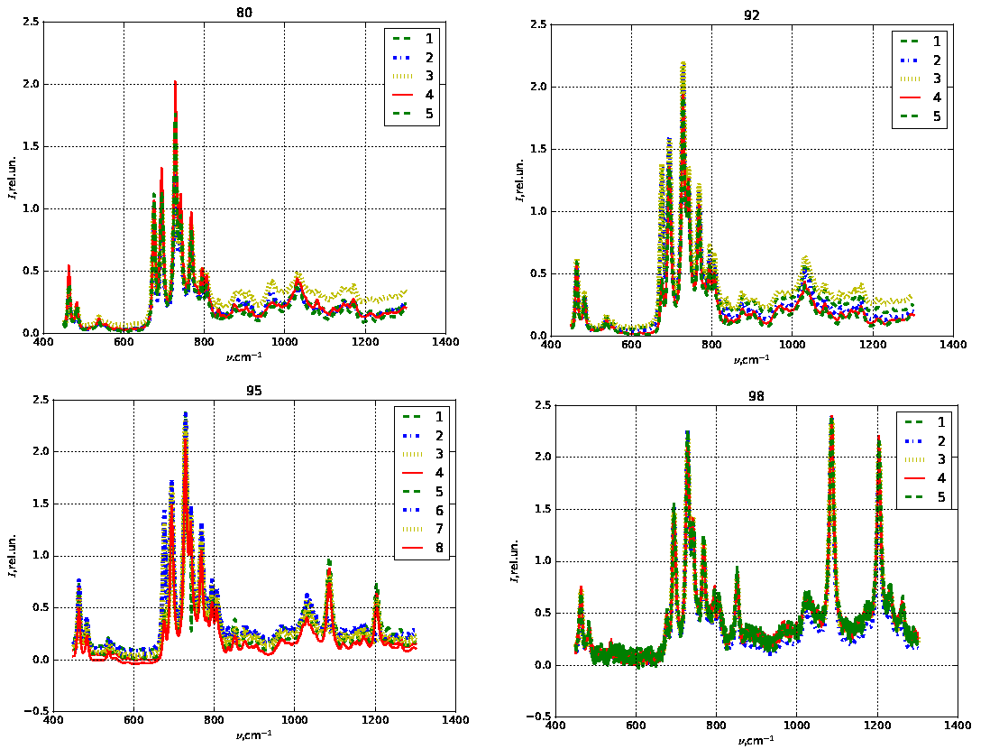
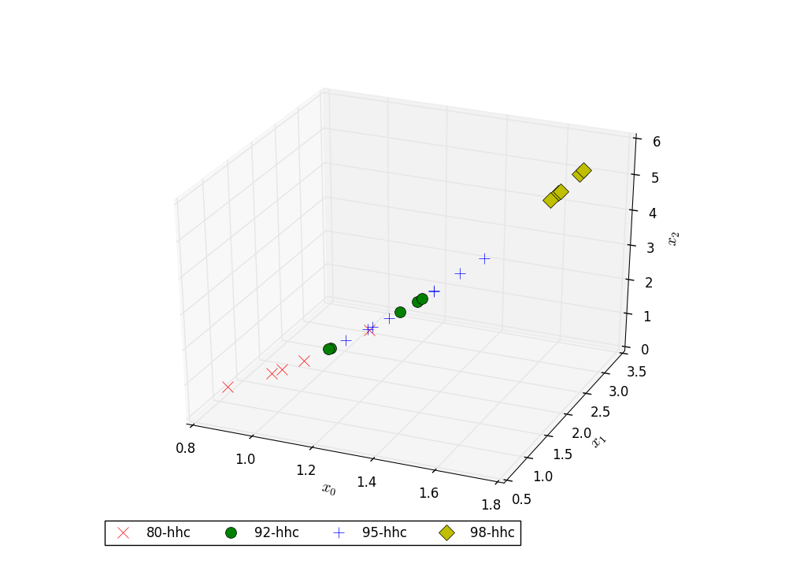
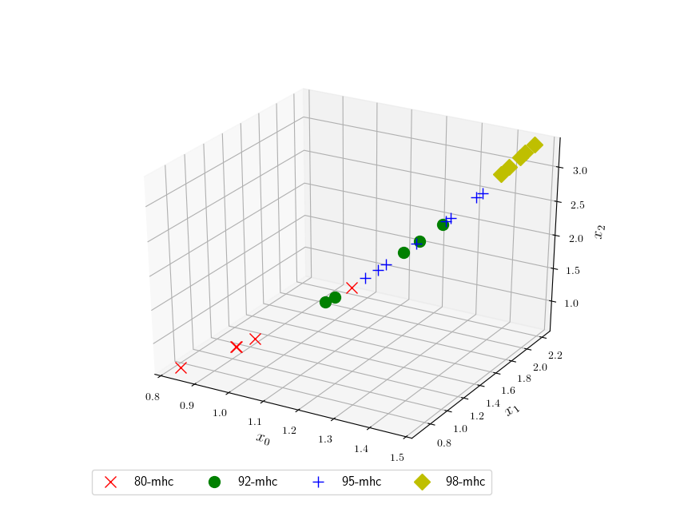

# Spectra Reduction


[](https://github.com/nikolskydn)
[](https://opensource.org/licenses/mit-license.php)


## Install

For install `spectra_reduction` perform commands:

 1. `./setup.py sdist` or `python3 setup.py sdist`

 2.  `cd dist` and `sudo python3 -m pip install spectra-reduction-X.Y.Z.tar.gz` 

The installer requires a `python3-setuptools` package.

## Programs list:

1. `view_spectra` &ndash; viewing raw spectra;

1. `reduce_spectra` &ndash; compression spectra;

1. `view_spectra_images3d` &ndash; viewing images.

The programs are dependent on the packages: 

* python3-numpy

* python3-scipy

* python3-matplotlib


## Usage

Illustrate by example.

From catalog `spectra_reduction` go to catalog with examples.

```cd ./examples/petrols```

The catalog contains a collection of spectra of petrols:

<pre>
$ ls *.csv
80.csv  92.csv  95.csv  98.csv 
</pre>

Make a compressed image using the command `reduce_spectra`. 
For an example, use the strategy HGSC:
<pre>
$ reduce_spectra 80.csv -s hgsc
$ reduce_spectra 92.csv -s hgsc
$ reduce_spectra 95.csv -s hgsc
$ reduce_spectra 98.csv -s hgsc
</pre>

Look  the result of compression by the command `view_spectra_images3d`:
<pre>
$ view_spectra_images3d 80-hgsc3d.npy 92-hgsc3d.npy 95-hgsc3d.npy 98-hgsc3d.npy -c
</pre>

## Result

The raw spectra of petrols are difficult to differ (see Figure 1).



After compression by the algorithm HGSC (Hilbert and Gram-Schmidt Compression) we obtain a 3D image for petrols spectra (see Figure 2). 
The effect of clustering is well visible.


The result of algorithm HHC (Hilbert and Histogram hash Compression) is shown in Figure 3.



The result of algorithm MHC (Media and Histogram hash Compression) is shown in Figure 4.


