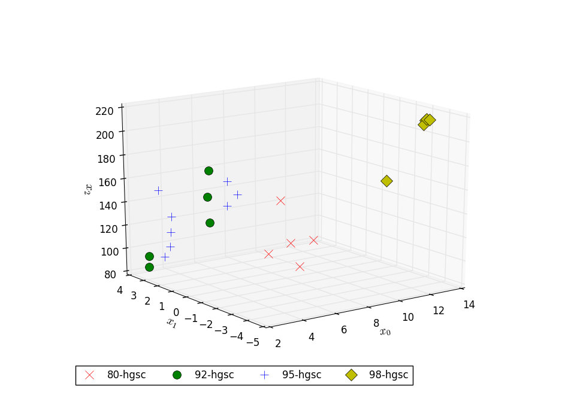

# Spectra Reduction


[](https://github.com/nikolskydn)
[](https://opensource.org/licenses/mit-license.php)


## Install

For install `spectra_reduction` perform commands:

 1. `./setup.py sdist` or `python3 setup.py sdist`

 2.  `cd dist` and `sudo python3 -m pip install spectra-reduction-X.Y.Z.tar.gz` 

## Programs list:

1. `view_spectra` Viewing raw spectra.

1. `reduce_spectra` Compression spectra.

1. `view_spectra_images3d` Viewing images.


## Usage

Illustrate by example.

From catalog `spectra-reduction` go to catalog with examples.

```cd ./examples/petrols```

## Result

The raw spectra of petrols are difficult to differ (see Figure 1).


After compression by the algorithm HGSC we obtain a 3D image for petrols spectra (see Figure 2). The effect of clustering is well visible.


